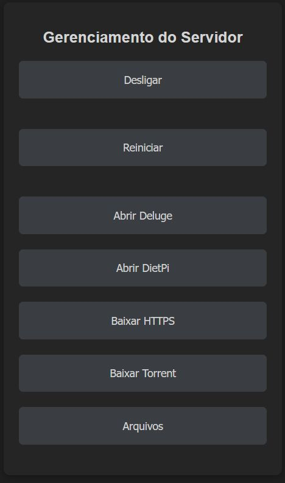
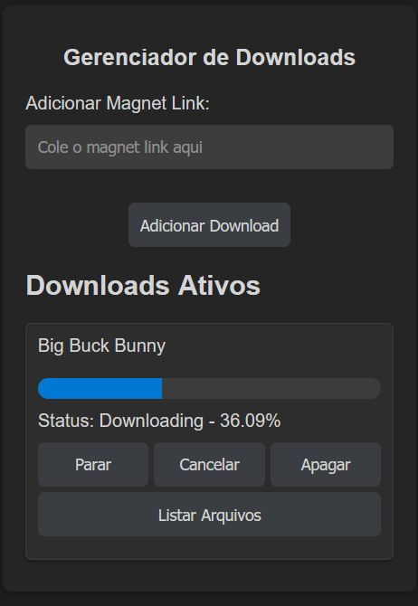
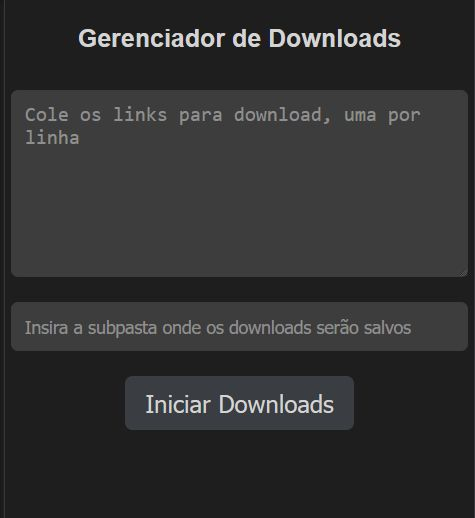

# Server Lite Controller


**Server Lite Controller** é uma interface leve e intuitiva para gerenciar servidores remotos, oferecendo funcionalidades de controle do sistema, gerenciamento de arquivos e downloads através de uma interface web responsiva. Desenvolvida especialmente para sistemas DietPi, mas compatível com qualquer distribuição baseada em Ubuntu ou Linux.

## 📋 Índice

- [Funcionalidades](#-funcionalidades)
- [Demonstração](#-demonstração)
- [Requisitos](#-requisitos)
- [Instalação](#-instalação)
- [Configuração](#-configuração)
- [Uso](#-uso)
- [API](#-api)
- [Executando como Serviço](#-executando-como-serviço)
- [Contribuição](#-contribuição)
- [Licença](#-licença)

## 🔧 Funcionalidades

### ⚙️ Controle do Sistema
- **Desligar/Reiniciar**: Controle remoto do servidor com comandos de desligamento e reinicialização
- **Monitoramento**: Visualização intuitiva do estado atual do servidor

### 📁 Gerenciador de Arquivos
- **Navegação de Diretórios**: Navegue facilmente pelos diretórios do servidor
- **Upload de Arquivos**: Faça upload de múltiplos arquivos simultaneamente
- **Operações em Lote**: Selecione e gerencie vários arquivos de uma vez
- **Criação de Pastas**: Crie novas estruturas de diretórios
- **Pesquisa**: Localize rapidamente arquivos e pastas
- **Download**: Baixe arquivos diretamente para seu dispositivo

### 📥 Gerenciamento de Downloads
- **Downloads HTTP**: Interface para baixar arquivos diretamente pela web
- **Controle de Downloads**: Pause, retome ou cancele downloads em andamento
- **Monitoramento de Progresso**: Acompanhe o progresso dos downloads em tempo real

### 🧲 Cliente de Torrents Integrado
- **Suporte a Magnet Links**: Adicione torrents facilmente via magnet links
- **Gerenciamento de Arquivos**: Selecione quais arquivos baixar em torrents
- **Controle Total**: Pause, retome ou cancele torrents conforme necessário
- **Monitoramento em Tempo Real**: Visualize o progresso e estado dos torrents

### 📱 Interface Responsiva
- **Compatibilidade Universal**: Funciona perfeitamente em celulares, tablets e computadores
- **Design Intuitivo**: Interface amigável tanto para usuários iniciantes quanto avançados
- **Atalhos Personalizáveis**: Acesse rapidamente outras ferramentas e serviços do seu servidor

## 🖼️ Demonstração

### Menu Principal

*Menu principal com opções de navegação e controle do servidor*

### Gerenciador de Torrents

*Interface para adicionar e gerenciar downloads de torrents*

### Downloads HTTP

*Interface para realizar e gerenciar downloads diretos*


## 📋 Requisitos

- Sistema operacional DietPi, Ubuntu ou outra distribuição Linux
- Python 3.7 ou superior
- Flask
- Cliente Deluge (para funcionalidade de torrents)
- Pacotes Python listados em `requirements.txt`

## 🚀 Instalação

1. Clone o repositório:
   ```bash
   git clone https://github.com/vagnervrds/server-lite-controller.git
   cd server-lite-controller
   ```

2. Crie e ative um ambiente virtual:
   ```bash
   # Linux/macOS
   python3 -m venv venv
   source venv/bin/activate
   
   # Windows
   python -m venv venv
   venv\Scripts\activate
   ```

3. Instale as dependências:
   ```bash
   pip install -r requirements.txt
   ```

4. Configure o arquivo `settings.json`:
   ```json
   {
     "DOWNLOAD_DIR": "/caminho/para/downloads",
     "delug": {
       "DELUGE_HOST": "localhost",
       "DELUGE_PORT": 58846,
       "DELUGE_USERNAME": "seu_usuario",
       "DELUGE_PASSWORD": "sua_senha"
     }
   }
   ```

5. Crie uma pasta `images` no diretório raiz e adicione suas capturas de tela:
   ```bash
   mkdir -p images
   # Adicione suas imagens: menu_principal.png, tela_torrent.png e download_http.png
   ```

5. Execute a aplicação:
   ```bash
   python app.py
   ```

6. Acesse a interface:
   ```
   http://localhost:5010
   ```

## ⚙️ Configuração

### Configuração do Deluge

Para habilitar o gerenciamento de torrents, você precisa configurar o cliente Deluge:

1. Instale o Deluge no servidor:
   ```bash
   # Debian/Ubuntu
   sudo apt-get install deluged deluge-web
   
   # Fedora/CentOS
   sudo dnf install deluge
   ```

2. Habilite o plugin Deluge RPC:
   - Acesse a interface web do Deluge ou cliente desktop
   - Vá para Preferências > Plugins
   - Ative o plugin "Daemon"

3. Configure o acesso remoto:
   - Edite o arquivo `~/.config/deluge/auth` (ou equivalente para Windows)
   - Adicione uma linha com: `usuario:senha:nivel` (ex: `admin:password:10`)

4. Atualize as credenciais em `settings.json`

### Configuração de Pastas

O diretório principal para downloads deve ser configurado em `settings.json`:

```json
{
  "DOWNLOAD_DIR": "/caminho/para/downloads"
}
```

Certifique-se de que o usuário que executa a aplicação tenha permissões de leitura e escrita neste diretório.

## 🎮 Uso

### Página Principal

A página inicial fornece atalhos para todas as funcionalidades principais:

- **Controle do Servidor**: Botões para desligar ou reiniciar o servidor
- **Downloads HTTP**: Interface para baixar arquivos da internet
- **Gerenciador de Torrents**: Adicione e gerencie torrents
- **Gerenciador de Arquivos**: Navegue e gerencie os arquivos do servidor

### Gerenciador de Arquivos

- **Navegação**: Clique nas pastas para navegar pelos diretórios
- **Operações**: Selecione os arquivos e use os botões de ação para upload, download ou exclusão
- **Nova Pasta**: Use o botão "Nova Pasta" para criar diretórios
- **Pesquisa**: Digite no campo de busca para encontrar arquivos

### Downloads HTTP

1. Cole a URL do arquivo que deseja baixar
2. Especifique a pasta de destino (opcional)
3. Clique em "Iniciar Download"
4. Use os controles para pausar, retomar ou cancelar o download

### Cliente de Torrents

1. Cole o magnet link do torrent
2. Clique em "Adicionar Torrent"
3. Selecione os arquivos que deseja baixar (opcional)
4. Use os controles para pausar, retomar ou cancelar torrents

## 🔌 API

O Server Lite Controller fornece várias APIs para integração com outros sistemas:

### Gerenciador de Arquivos API

- `GET /filemanager/api/list?path=<caminho>` - Lista os arquivos em um diretório
- `POST /filemanager/api/upload` - Faz upload de arquivos
- `POST /filemanager/api/create_folder` - Cria uma nova pasta
- `POST /filemanager/api/delete_multiple` - Exclui múltiplos arquivos/pastas
- `GET /filemanager/api/search?q=<termo>` - Pesquisa arquivos e pastas
- `GET /filemanager/download/<caminho>` - Baixa um arquivo

### Torrents API

- `GET /torrent/downloads` - Lista todos os torrents ativos
- `POST /torrent/stop/<id>` - Pausa um torrent
- `POST /torrent/resume/<id>` - Retoma um torrent
- `POST /torrent/cancel/<id>` - Cancela um torrent (mantém arquivos)
- `POST /torrent/delete/<id>` - Remove um torrent (apaga arquivos)
- `GET /torrent/list-files/<id>` - Lista os arquivos de um torrent
- `POST /torrent/cancel-files/<id>` - Atualiza prioridades de arquivos em um torrent

### Downloads HTTP API

- `GET /downloads/progress` - Obtém o progresso de todos os downloads
- `POST /downloads/control` - Controla downloads (pausa, retoma, cancela)

## 🔄 Executando como Serviço

Para garantir que o Server Lite Controller seja executado continuamente:

1. Crie um arquivo de serviço do systemd:
   ```bash
   sudo nano /etc/systemd/system/server-lite-controller.service
   ```

2. Adicione o seguinte conteúdo:
   ```ini
   [Unit]
   Description=Server Lite Controller
   After=network.target

   [Service]
   User=root
   WorkingDirectory=/caminho/para/server-lite-controller
   Environment="PATH=/caminho/para/server-lite-controller/venv/bin"
   ExecStart=/caminho/para/server-lite-controller/venv/bin/python app.py
   Restart=always

   [Install]
   WantedBy=multi-user.target
   ```

3. Ative e inicie o serviço:
   ```bash
   sudo systemctl daemon-reload
   sudo systemctl start server-lite-controller
   sudo systemctl enable server-lite-controller
   ```

4. Verifique o status:
   ```bash
   sudo systemctl status server-lite-controller
   ```

## 👥 Contribuição

Contribuições são bem-vindas! Para contribuir:

1. Faça um fork do repositório
2. Crie uma branch para sua feature:
   ```bash
   git checkout -b minha-feature
   ```
3. Faça suas alterações e commit:
   ```bash
   git commit -m "Descrição da minha feature"
   ```
4. Envie para seu fork:
   ```bash
   git push origin minha-feature
   ```
5. Abra um Pull Request

### Diretrizes de Contribuição

- Siga o estilo de código existente
- Adicione testes para novas funcionalidades
- Atualize a documentação conforme necessário
- Descreva suas alterações detalhadamente no Pull Request

## 📄 Licença

Este projeto está licenciado sob a Licença MIT - veja o arquivo [LICENSE](LICENSE) para detalhes.

---

Desenvolvido com ❤️ por Vagner

*Esse projeto foi criado com a ajuda das IAs Claude e ChatGPT, demonstrando o potencial da colaboração entre humanos e inteligência artificial no desenvolvimento de software.*